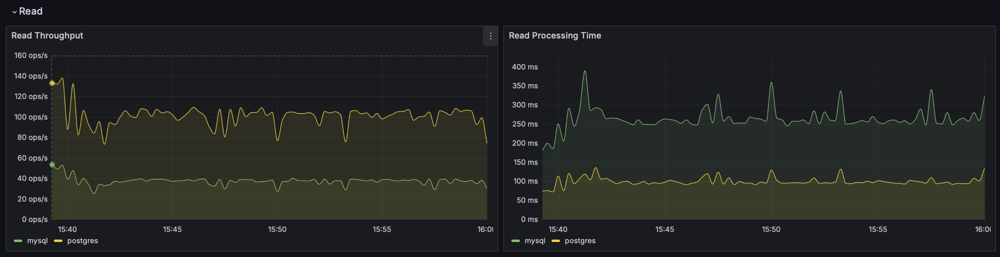
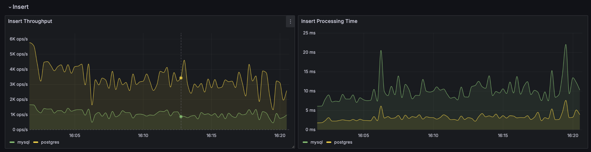
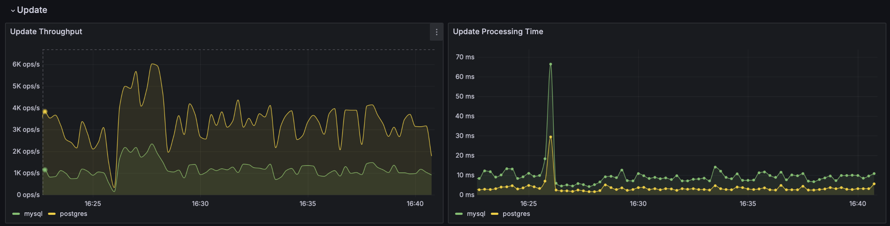

# Database Performance Benchmark

## Background: 왜 이 벤치마크를 시작했는가?

### 1. Pain Point
DorumDorum은 기숙사 룸메이트를 매칭해주는 서비스입니다. 이 서비스에서 유저가 가장 먼저 마주하는 핵심 기능은 **20개 이상의 생활 습관 필터링을 통한 룸메이트 검색** 및 실시간 채팅입니다.
유저는 본인과 맞는 사람을 찾기 위해 '흡연 여부', '수면 시간', '청소 주기' 등 수많은 조건을 선택합니다.

이 프로젝트의 목표는 단순히 MySQL과 PostgreSQL 중 “더 빠른 DB”를 찾는 것이 아닙니다.
핵심은 **DorumDorum의 실제 요구사항에 더 잘 맞는 DB를 선택하는 것**입니다.

현재 서비스 요구사항은 다음과 같이 정리할 수 있습니다.

- 여러 생활 습관 조건을 조합하는 **동적 필터 검색**이 자주 발생한다.
- 검색 결과는 단순 목록이 아니라 **정렬/페이지네이션**까지 포함한다.
- 방 생성 시 `room`과 `checklist`가 함께 저장되어야 하므로 **정합성 있는 쓰기**가 필요하다.
- 체크리스트 수정이 반복적으로 발생하므로 **update 비용과 안정성**도 중요하다.
- 현재 단계에서는 무조건적인 분산 확장성보다, **지금 서비스 규모에서의 응답 속도와 운영 단순성**이 더 중요하다.

### 2. Technical Challenge
* **동적 쿼리의 복잡성:** 유저마다 선택하는 필터 조합이 수만 가지에 달하며, 이는 DB 입장에서 고정된 인덱스 전략을 세우기 어렵게 만듭니다.
* **데이터 정합성 vs 성능:** 매칭 신청이나 프로필 수정이 빈번하게 일어나는 상황(Write)에서도 검색 결과(Read)는 빠르고 정확해야 합니다.
* **MVCC 오버헤드:** 20개가 넘는 컬럼을 가진 '넓은 테이블(Wide Table)' 구조에서 수정(Update)이 발생할 때, DB 엔진의 아키텍처(Undo Log vs Tuple Versioning)에 따라 성능 저하 폭이 크게 다를 것이라 판단했습니다.

### 3. Objective
단순히 유행하는 기술 스택을 추종하는 것이 아니라, **실제 서비스의 데이터 구조와 쿼리 패턴을 기반으로 가설을 설정하고, 이를 수치화된 벤치마크 데이터로 검증**하여 최적의 인프라를 선정하는 것을 목적으로 합니다.
즉 이 문서는 일반적인 DB 성능 비교 문서가 아니라, **DorumDorum의 검색/생성/수정 요구사항을 기준으로 어떤 DB가 더 적합한지 판단하기 위한 의사결정 문서**입니다.

---

## Track 1. RDB 비교: MySQL 8.4 vs PostgreSQL 16

Track 1의 진행 방식은 아래 순서를 따른다.

1. **엔진 테스트**로 MySQL과 PostgreSQL의 기본적인 조회/생성/수정 성능 차이를 먼저 확인한다.
2. 그 결과를 바탕으로 **초기 가설(H1, H2, H3)** 이 실제로 지지되는지 검증한다.
3. 이후 **k6 API 부하 테스트**로 애플리케이션 레벨에서 다시 비교한다.
4. 마지막으로 엔진 테스트와 API 부하 테스트 결과를 함께 해석해, **DorumDorum 서비스에 더 적합한 DB가 무엇인지 판단**한다.

즉 Track 1은 단순한 엔진 성능 비교로 끝나는 것이 아니라,
**엔진 레벨 비교 → 가설 검증 → API 레벨 비교 → 서비스 적합성 판단**까지 이어지는 의사결정 흐름으로 설계되어 있다.

### 1. 가설 설정 (Hypothesis)

| 가설 | 내용 | 근거                                                   |
|:--- |:--- |:-----------------------------------------------------|
| **H1 (조회)** | **5개 이상 다중 필터** 조건에서 PostgreSQL의 **Bitmap Index Scan**이 MySQL의 **Index Merge**보다 우세할 것이다. | 여러 단일 인덱스를 메모리에서 결합하여 비트맵으로 연산하는 능력의 차이              |
| **H2 (수정)** | **잦은 Update** 발생 시, MySQL(Undo Log)이 PostgreSQL(Tuple Copy)보다 **Table Bloat** 현상이 적고 성능이 안정적일 것이다. | **MVCC 구현 방식**에 따른 구버전 데이터 관리 및 디스크 I/O 효율성          |
| **H3 (생성)** | **데이터 삽입(Insert)** 시, Clustered Index 구조인 MySQL이 물리적 정렬 이득으로 인해 처리량이 높을 것이다. | 데이터가 PK 순서대로 물리적으로 정렬되는지(Clustered) vs Heap에 쌓이는지 차이 |

가설 검증 시 근거는 시나리오별로 다르게 잡는다.

- **Read**: `EXPLAIN` / `EXPLAIN ANALYZE`를 통해 실제 실행계획을 직접 비교한다.
- **Update**: `EXPLAIN`으로 대상 row 탐색 방식을 확인하고, PostgreSQL의 `n_dead_tup`, `n_tup_hot_upd` 같은 내부 통계를 함께 본다.
- **Insert**: 실행계획보다 **쓰기 경로의 구조적 비용**을 본다. 즉 인덱스 개수, 트랜잭션 단위, insert 대상 테이블 구조, k6 결과(avg/p95/throughput)를 함께 해석한다.

---

### 2. MVCC(Multi-Version Concurrency Control) 아키텍처 비교
본 벤치마크는 두 DB가 동시성을 제어하는 근본적인 메커니즘 차이를 추적합니다.

#### **MySQL (InnoDB): Undo Log 방식**
* **메커니즘:** 데이터를 수정할 때 원본 페이지의 데이터를 **직접 수정**하고, 이전 값은 **Undo Log** 영역에 기록합니다.
* **영향:** 20개의 필드 중 1개만 수정해도 변경된 값만 로그에 남기므로 스토리지 오버헤드가 적습니다. 하지만 긴 트랜잭션이 유지될 경우 Undo Log가 비대해져 전체 성능을 저하시킬 수 있습니다.

#### **PostgreSQL: Tuple Versioning 방식**
* **메커니즘:** 데이터를 수정할 때 기존 행을 건드리지 않고, **새로운 행(Tuple)을 통째로 생성**합니다. 기존 행은 Dead Tuple이 됩니다.
* **영향:** 20개 필드 중 하나만 수정해도 행 전체가 새로 복사되므로 **Table Bloat(테이블 부풀림)** 현상이 발생합니다. 이를 정리하는 `VACUUM` 프로세스가 성능의 핵심 변수가 됩니다.

---

### 3. 워크로드 시나리오 (20개 항목 체크리스트 기준)

#### **A. 동적 필터 조회 (Read)**
* **상황:** 유저가 흡연, 수면시간 등 20개 조건 중 5~10개를 선택해 룸메이트를 검색함.
* **쿼리:** `SELECT * FROM checklist WHERE smoking='NON_SMOKER' AND cleaning='DAILY' ... LIMIT 1000`
* **검증:** 복합 인덱스가 없는 상황에서 각 DB가 여러 단일 인덱스를 얼마나 효율적으로 병합(Merge)하는지 측정.

#### **B. 생성 (Create)**
* **상황:** 새로운 유저가 자신의 생활 습관 20개 항목을 입력하고 저장함.
* **검증:** 다수의 인덱스(10개 이상)가 걸린 상태에서 새로운 데이터를 삽입할 때 발생하는 인덱스 쓰기 지연(Latency) 비교.

#### **C. 수정 (Update)**
* **상황:** 유저가 자신의 체크리스트 중 '기타 특이사항(Text)'이나 '기상 시간'을 수정함.
* **검증:** 수정 발생 시 실제 디스크 사용량 변화와, 수정 작업이 동시에 진행될 때 조회 쿼리의 응답 속도 변화(MVCC 격리 수준 검증).

---

### 4. 실험 환경 및 도구
- **Target:** MySQL 8.4 / PostgreSQL 16 (Docker 컨테이너)
- **API:** Spring Boot 3.2 (QueryDSL을 활용한 20개 항목 동적 필터링 구현)
- **Load Tool:** **k6** (동시성 부하 테스트), **sysbench** (MySQL), **pgbench** (PostgreSQL)
- **Monitoring:** Prometheus + Grafana (CPU, Memory, Disk I/O, DB Lock 현황 시각화)

#### 엔진 벤치마크 공통 조건 (MySQL vs PostgreSQL)

두 DB를 **동일 조건**으로 비교하기 위해 아래 설정을 맞춰 둠.

| 항목 | MySQL | PostgreSQL |
|------|-------|------------|
| **버퍼/캐시** | innodb_buffer_pool_size=128M | shared_buffers=128MB |
| **정렬/해시 메모리** | sort_buffer_size=2M | work_mem=2MB |
| **max_connections** | 300 | 300 |
| **동시 클라이언트** | 10 (CLIENTS) | 10 (CLIENTS) |
| **컨테이너 메모리** | 1GB | 1GB |
| **기본 시나리오 duration** | 300초 | 300초 |

*macOS에서 pgbench "No space left on device" 시*: Docker Desktop → Settings → Resources → Memory **4GB 이상**으로 설정.

---

### 5. 현재 엔진 시나리오

- **Read**: 다중 필터로 후보를 좁힌 뒤 남은 인원수 기준으로 정렬
- **Insert**: `room` + `checklist` 생성
- **Update**: `checklist` 여러 필드를 동시에 수정하는 wide-row update

### 6. 결과 확인

엔진 결과 요약:

```bash
bash scripts/summarize-engine-results.sh
```

결과 위치:

- `benchmarks/engine/mysql-vs-postgres/results/mysql/*.txt`
- `benchmarks/engine/mysql-vs-postgres/results/postgres/*.txt`
- `benchmarks/engine/mysql-vs-postgres/results/k6/mysql/*.json`
- `benchmarks/engine/mysql-vs-postgres/results/k6/postgres/*.json`

Grafana 대시보드:

- `MySQL vs PostgreSQL Engine Benchmark`
- `Run ID` 드롭다운으로 이번 실행만 선택 가능

---

### 7. 현재 결과 분석

아래 결과는 `2026-03-20` 기준 최신 엔진 벤치마크 실행(`run_id` 기준 최신 실행)에서 관찰한 값이다.
해당 실행은 `TIME_SECONDS=1200`, `WINDOW_SECONDS=5`, `CLIENTS=10` 기준으로 각 시나리오를 **20분씩** 수행했다.

#### 1. Read



| DB | Throughput | Processing Time |
|----|------------|-----------------|
| MySQL | 55.09 TPS | 179.83 ms |
| PostgreSQL | 138.87 TPS | 72.01 ms |

**해석**

- PostgreSQL이 처리량에서 약 `2.5배`, 평균 처리시간에서 약 `60%` 수준으로 우세했다.
- 현재 Read 시나리오는 단순 정렬 조회가 아니라, **다중 필터로 후보를 좁힌 뒤 남은 인원수로 정렬**하는 형태다.
- 이 쿼리는 `room + checklist` 조인, 여러 조건 선택도 계산, 정렬이 함께 걸린다.
- 이런 형태에서는 PostgreSQL이 여러 조건을 좁혀 가는 계획 수립과 실행에서 더 유리하게 작동했고, MySQL은 동일 조건에서 더 적은 TPS와 더 높은 평균 latency를 보였다.

**가설 대조**

- `H1 (조회): PostgreSQL 우세`
- 현재 결과는 **H1을 지지**한다.

**근거**

- MySQL의 최신 실행계획에서는 `checklist` 조건에 대해 `index_merge`가 사용되며, `idx_checklist_refrigerator`, `idx_checklist_smoking`, `idx_checklist_phone_call`, `idx_checklist_return_home`, `idx_checklist_sleep_light`를 교집합 형태로 결합한다.
- 하지만 MySQL은 여전히 `using_temporary_table: true`, `using_filesort: true`가 나타난다. 즉 후보 집합을 줄인 뒤에도 정렬과 임시 테이블 비용을 추가로 부담한다.
- PostgreSQL 실행계획에서는 `Bitmap Index Scan`, `BitmapAnd`, `Bitmap Heap Scan`, `Hash Join`, 작은 `Sort`가 나타난다. 즉 후보 집합을 먼저 줄인 뒤 조인과 정렬로 넘어가는 구조가 더 명확하게 보인다.
- 따라서 H1은 단순히 “결과가 더 빨랐다” 수준이 아니라, **다중 조건 필터 + 조인 + 정렬이라는 현재 read 시나리오에서 PostgreSQL 쪽 계획이 더 유리하게 작동했기 때문에 지지한다**고 해석할 수 있다.

#### 2. Insert



| DB | Throughput | Processing Time |
|----|------------|-----------------|
| MySQL | 1635.72 TPS | 6.11 ms |
| PostgreSQL | 2872.84 TPS | 3.48 ms |

**해석**

- PostgreSQL이 처리량과 평균 처리시간 모두에서 더 좋았다.
- Insert 시나리오는 `room` 1건과 `checklist` 1건을 생성하는 비교적 단순한 쓰기 트랜잭션이다.
- 원래 가설은 InnoDB의 clustered index가 순차 삽입에서 유리할 것이라고 봤지만, 현재 조건에서는 그 이점보다 PostgreSQL의 실제 실행 경로가 더 효율적으로 나타났다.
- 특히 현재 워크로드는 대량 배치 삽입이라기보다 짧은 단건 트랜잭션 반복에 가깝기 때문에, MySQL의 물리적 정렬 이점이 기대만큼 크게 드러나지 않았다.

**가설 대조**

- `H3 (생성): MySQL 우세`
- 현재 결과는 **H3를 지지하지 않는다**.

**근거**

- 현재 insert 시나리오는 `room` 1건 생성 후 `checklist` 1건을 이어서 저장하는 **짧은 단건 트랜잭션 반복**이다.
- `checklist`에는 다수의 보조 인덱스가 걸려 있으므로, 이 시나리오는 단순 row append가 아니라 **인덱스 유지 비용**까지 함께 포함한다.
- H3는 InnoDB의 clustered index가 순차 insert에 유리할 것이라는 가설이지만, 현재 워크로드는 대량 배치 적재가 아니라 애플리케이션 레벨의 반복 생성 API에 가깝다.
- 따라서 이 시나리오에서 MySQL이 실제 우위를 보이지 않았다면, 적어도 **현재 서비스형 생성 패턴에서는 clustered index 이점이 기대한 만큼 성능 우위로 연결되지 않았다고 판단**하는 것이 맞다.
- 다만 Insert는 실행계획만으로 원인을 단정하기 어렵기 때문에, 이 가설 미지지는 **결과 기반 해석**으로 이해해야 한다.

#### 3. Update



| DB | Throughput | Processing Time |
|----|------------|-----------------|
| MySQL | 1174.81 TPS | 8.50 ms |
| PostgreSQL | 2720.71 TPS | 3.68 ms |

**해석**

- PostgreSQL이 처리량과 평균 처리시간 모두에서 우세했다.
- 현재 Update 시나리오는 단건 경량 수정이 아니라, `bedtime`, `wake_up`, `cleaning`, `phone_call`, `sleep_light`, `smoking`, `other_notes`, `updated_at`를 함께 바꾸는 **wide-row update**다.
- 원래는 PostgreSQL의 tuple copy 방식이 row 전체 재기록과 dead tuple 누적으로 더 불리할 것으로 예상했지만, 현재 실험 시간과 데이터 규모에서는 그 누적 불이익보다 PostgreSQL의 실제 update 처리량이 더 좋게 나왔다.
- 즉, **현재 20분 기준 결과만 놓고 보면** PostgreSQL의 MVCC 오버헤드가 MySQL보다 더 크게 드러나지 않았다.

**가설 대조**

- `H2 (수정): MySQL 우세`
- 현재 결과는 **H2를 지지하지 않는다**.

**근거**

- MySQL과 PostgreSQL 모두 `room_no` 기준 유니크 인덱스를 타고 단건 row를 찾는다. 즉 “대상 row를 찾는 비용” 자체는 두 DB 모두 크지 않다.
- 현재 시나리오는 `bedtime`, `wake_up`, `cleaning`, `phone_call`, `sleep_light`, `smoking`, `other_notes`, `updated_at`를 함께 바꾸는 **wide-row update**다.
- PostgreSQL 쪽 내부 통계를 보면, 짧은 wide update 후 `n_tup_upd = 1000`, `n_dead_tup = 1000`, `n_tup_hot_upd = 0`이 확인된다.
- 의미는 다음과 같다.
  - PostgreSQL에서는 실제로 dead tuple이 생성되고 있다.
  - 인덱스 컬럼을 바꾸기 때문에 HOT update는 사용되지 않는다.
- 즉 H2가 예상한 PostgreSQL의 MVCC 불리함은 실제로 존재하는 현상이다.
- 그럼에도 이번 결과에서 PostgreSQL이 더 높은 처리량과 더 낮은 평균 처리시간을 보였다면, **현재 데이터 규모와 실험 시간 범위에서는 그 불리함이 MySQL 대비 더 큰 성능 저하로 이어지지 않았다고 판단**해야 한다.
- 따라서 H2는 “이론적으로 가능하다”가 아니라 “이번 실험에서는 재현되지 않았다”는 의미에서 지지하지 않는다고 정리하는 것이 맞다.

#### 4. 종합 결론

현재 벤치마크 기준으로는 **PostgreSQL이 DorumDorum 서비스에 더 적합하다**고 보는 것이 합리적이다.

근거는 다음과 같다.

- 서비스 핵심 기능은 **다중 필터 기반 룸메이트 검색**이고, 가장 중요한 Read 시나리오에서 PostgreSQL이 큰 차이로 우세하다.
- Update 역시 실제 서비스형 wide-row 수정 시나리오로 바꾼 뒤에도 PostgreSQL이 더 높은 처리량과 더 낮은 처리시간을 보였다.
- Insert는 서비스의 핵심 병목은 아니지만, 현재 측정에서는 PostgreSQL이 여기서도 앞섰다.

따라서 현재 실험 결과를 서비스 선택 관점에서 해석하면:

- **검색 성능이 가장 중요하다면 PostgreSQL이 더 적합하다.**
- **현재 데이터 구조와 쿼리 패턴에서는 PostgreSQL이 읽기/쓰기 모두 더 안정적인 후보로 보인다.**
- MySQL이 우세하다는 초기 가설(H2, H3)은 이번 실험 조건에서는 재현되지 않았다.

단, 이 결론은 어디까지나 **현재 인덱스 구성, 현재 시나리오, 현재 동시성(10 clients), 현재 실행 시간(20분)** 기준이다.
만약 더 장시간의 update-hotspot 시나리오나 더 큰 데이터 규모에서 다시 측정하면 H2의 결론은 달라질 수 있다.

---

### 8. 관측 메모

- `parallel`은 같은 시간대 Grafana 관측용이다. 최종 절대 비교 수치는 `all` 기준으로 해석하는 편이 낫다.
- `run-engine-bench.sh`는 실행 전에 DB 포트 연결과 `room` / `checklist` seed row count를 검증한다.
- 각 시나리오 종료 후 해당 시나리오 메트릭은 Pushgateway에서 삭제되어, 이전 색상이 다음 시나리오 구간까지 이어지지 않는다.

### 9. API 부하 테스트로 한 번 더 검증

엔진 테스트는 DB 자체 특성을 비교하는 데 유리하지만, 실제 서비스 응답 시간에는 애플리케이션 로직, 직렬화, 네트워크, 커넥션 풀, ORM 동작이 함께 반영된다.
따라서 Track 1의 최종 판단은 엔진 테스트만으로 끝내지 않고, **k6 API 부하 테스트로 한 번 더 검증**한다.

이 단계에서는 다음을 확인한다.

- 엔진 테스트에서 나타난 우열이 실제 API 응답 시간에서도 유지되는가
- 평균값뿐 아니라 `p95`, `p99`, `failed rate`에서도 같은 방향이 나타나는가
- DB 차이보다 애플리케이션 레이어 오버헤드가 더 크게 작용하는 시나리오가 있는가

#### 1. Read Heavy

| DB | avg | p95 | p99 | failed | throughput |
|----|-----|-----|-----|--------|------------|
| MySQL | TBD | TBD | TBD | TBD | TBD |
| PostgreSQL | TBD | TBD | TBD | TBD | TBD |

검증 포인트:

- 엔진 테스트의 Read 우세가 API 검색 응답 시간에서도 유지되는가
- 다중 필터 + 정렬 + 페이지네이션이 실제 서비스 레이어에서 어느 정도 증폭되는가

#### 2. Write Heavy

| DB | avg | p95 | p99 | failed | throughput |
|----|-----|-----|-----|--------|------------|
| MySQL | TBD | TBD | TBD | TBD | TBD |
| PostgreSQL | TBD | TBD | TBD | TBD | TBD |

검증 포인트:

- 생성 API에서 DB 차이가 실제 애플리케이션 응답 시간 차이로도 이어지는가
- insert 시나리오의 엔진 비교 결과가 API 레벨에서도 같은 방향을 보이는가

#### 3. Update Heavy

| DB | avg | p95 | p99 | failed | throughput |
|----|-----|-----|-----|--------|------------|
| MySQL | TBD | TBD | TBD | TBD | TBD |
| PostgreSQL | TBD | TBD | TBD | TBD | TBD |

검증 포인트:

- wide-row update의 엔진 비교 결과가 실제 수정 API에서도 유지되는가
- 평균값보다 tail latency와 실패율에서 차이가 크게 나는가

#### 4. API 레벨 종합 판단

| 항목 | 엔진 테스트 결론 | API 부하 테스트 결론 | 최종 판단 |
|------|------------------|----------------------|-----------|
| Read | TBD | TBD | TBD |
| Insert | TBD | TBD | TBD |
| Update | TBD | TBD | TBD |

이 표는 엔진 테스트와 k6 API 부하 테스트 결과를 함께 놓고,
**최종적으로 DorumDorum 서비스에 더 적합한 DB를 판단하는 마지막 검증 단계**로 사용한다.

---

## Track 2. RDB vs NoSQL (MongoDB)
*(Track 1 종료 후 진행 예정)*

### 1. 개요

- **워크로드:** 채팅 메시지 Write-heavy/Read-heavy 시나리오
- **비교 포인트:** 수평 확장성(Sharding), 스키마 유연성, 고빈도 삽입 성능
- **상태:** [Pending]

### 2. 실험 환경 및 도구

- **상태:** Track 1 종료 후 작성 예정

---

## 실행 방법

<details>
<summary>펴서 보기</summary>

### 1. 전체 초기화 후 기동

```bash
docker compose -f docker-compose.bench.yml down -v
python3 scripts/generate-seed-data.py
docker compose -f docker-compose.bench.yml up -d
sleep 120
```

접속 포인트:

- Grafana: `http://127.0.0.1:3001`
- Prometheus: `http://127.0.0.1:9091`
- Pushgateway: `http://127.0.0.1:19092`

### 2. 엔진 벤치마크

기본값:

- `TIME_SECONDS=300` (각 시나리오 5분)
- `WINDOW_SECONDS=5` (Grafana 시계열 갱신 단위)
- `SCENARIOS="room-checklist-read room-checklist-insert room-checklist-update"`

순차 비교:

```bash
WINDOW_SECONDS=5 bash scripts/run-engine-bench.sh all
```

동시 관측:

```bash
TIME_SECONDS=1200 WINDOW_SECONDS=5 bash scripts/run-engine-bench.sh parallel
```

MySQL만:

```bash
WINDOW_SECONDS=5 bash scripts/run-engine-bench.sh mysql
```

PostgreSQL만:

```bash
WINDOW_SECONDS=5 bash scripts/run-engine-bench.sh postgres
```

튜닝 예시:

```bash
CLIENTS=20 TIME_SECONDS=600 WINDOW_SECONDS=5 bash scripts/run-engine-bench.sh all
CLIENTS=20 JOBS=8 TIME_SECONDS=600 WINDOW_SECONDS=5 bash scripts/run-engine-bench.sh postgres
SCENARIOS=room-checklist-update WINDOW_SECONDS=5 bash scripts/run-engine-bench.sh parallel
```

### 3. API 부하 테스트

MySQL:

```bash
bash scripts/run-api-bench.sh mysql read-heavy 3
bash scripts/run-api-bench.sh mysql write-heavy 3
bash scripts/run-api-bench.sh mysql update-heavy 3
```

PostgreSQL:

```bash
bash scripts/run-api-bench.sh postgres read-heavy 3
bash scripts/run-api-bench.sh postgres write-heavy 3
bash scripts/run-api-bench.sh postgres update-heavy 3
```

</details>
